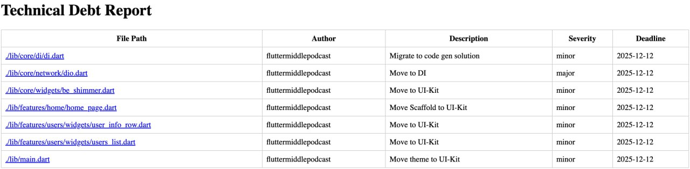

# technical_debt

Создание отчета о техническом долге при помощи генераторов кода на Дарте и кастомных аннотаций.



## Если будете использовать у себя в проекте

Решение в репозитории - не конечный вариант, хотя рабочий. Написано при помощи AI, для своих целей лучше пересмотреть
все содержимое.

**Что нужно сделать:**

- вынести аннотации в отдельный пакет;
- импортировать аннотации в `dependencies`, а сам генератор в `dev_dependencies`;
- настроить парсинг [даты дедлайна](#аннотации-technicaldebt).

## Структура проекта

### TechnicalDebtDataCollector

[Файл тут](lib/generators/technical_debt_data_collector.dart).

Собирает все технические долги по проекту и конвертирует полученную информацию в `JSON`.

### TechnicalDebtReportGenerator

[Файл тут](./lib/generators/technical_debt_report_generator.dart).

Генератор `HTML`-репорта. За счет разделения сбора данных и генератора, можно изменить формат либо же создавать сразу
несколько отчетов для разных систем.

## Аннотация TechnicalDebt

Маркер технического долга. Можно отмечать поля, методы, классы, и любые другие элементы кода.

**Параметры:**

| Название      | Значение   | Обязательно | Описание                                                                                                                            |
|---------------|------------|-------------|-------------------------------------------------------------------------------------------------------------------------------------|
| `author`      | `String`   | Да          | Указываем автора метки. В идеале должна быть либо почта, либо имя пользователя в той системе, где вы работаете.                     |
| `description` | `String`   | Да          | Описание проблемного элемента в коде. Лучше делать максимально понятным, чтобы и самим можно было легко вспомнить, в чем дело.      |
| `severity`    | `Severity` | Да          | Серьезность технического долга. `minor` - можно поправить когда-нибудь потом, не горит. `major` - нужно поправить как можно скорее. |
| `deadline`    | `String`   | Нет         | Дата, к которой технического долга быть уже не должно.                                                                              |

## Как использовать?

**Импортируем зависимости в `pubspec.yaml` (смотри комментарии выше по поводу доработок):**

```yaml
dependencies:
  technical_debt:
    git:
      url: https://github.com/fluttermiddlepodcast/technical_debt
```

**Пометить нужный элемент кода аннотацией `TechnicalDebt`:**

```dart
@TechnicalDebt(
  author: 'fluttermiddlepodcast',
  description: 'Move to UI-Kit',
  severity: Severity.minor,
  deadline: '2025-12-12',
)
class BEShimmer extends StatelessWidget {
  final double height;
  final double width;

  const BEShimmer({
    super.key,
    required this.height,
    required this.width,
  });

  @override
  Widget build(BuildContext context) {
    return Shimmer.fromColors(
      baseColor: Colors.grey.shade300,
      highlightColor: Colors.grey.shade50,
      child: SizedBox(
        height: height,
        width: width,
        child: const ColoredBox(
          color: Colors.white,
        ),
      ),
    );
  }
}
```

**Добавить в `build.yaml` конфигурацию для билдеров:**

```yaml
targets:
  $default:
    builders:
      technical_debt|technical_debt_collector:
        enabled: true
        generate_for:
          - lib/**
      technical_debt|technical_debt_reporter:
        enabled: true
        generate_for:
          - "**/*.technical_debt.json"

builders:
  technical_debt_collector:
    import: "package:technical_debt/builder_collector.dart"
    auto_apply: root_package
    builder_factories: [ "technicalDebtCollector" ]
    build_extensions: { ".dart": [ ".technical_debt.json" ] }
    build_to: source

  technical_debt_reporter:
    import: "package:technical_debt/builder_reporter.dart"
    auto_apply: root_package
    builder_factories: [ "technicalDebtReporter" ]
    build_extensions: { ".technical_debt.json": [ "technical_debt_report.html" ] }
    build_to: source
    required_inputs: [ ".technical_debt.json" ]
```

**Запустить генератор кода:**

```shell
$ fvm flutter pub run build_runner build --delete-conflicting-outputs
```

## Где посмотреть?

В [bloc_example](https://github.com/fluttermiddlepodcast/bloc_example/)
есть [отдельная ветка](https://github.com/fluttermiddlepodcast/bloc_example/tree/technical_debt) с
несколькими участками кода, помеченными аннотациями `TechnicalDebt`.

**Вот сами файлы:**

[./lib/core/di/di.dart](https://github.com/fluttermiddlepodcast/bloc_example/blob/master/lib/core/di/di.dart)

```dart
@TechnicalDebt(
  author: 'fluttermiddlepodcast',
  description: 'Migrate to code gen solution',
  severity: Severity.minor,
  deadline: '2025-12-12',
)
Future<void> initDI() async {
  di.registerSingleton<Dio>(dio);
  di.registerSingleton<UsersRepository>(
    UsersRepositoryImpl(
      di.get<Dio>(),
    ),
  );
}
```

[./lib/core/network/dio.dart](https://github.com/fluttermiddlepodcast/bloc_example/blob/technical_debt/lib/core/network/dio.dart)

```dart

@TechnicalDebt(
  author: 'fluttermiddlepodcast',
  description: 'Move to DI',
  severity: Severity.major,
  deadline: '2025-12-12',
)
final dio = Dio(
  BaseOptions(
    baseUrl: 'https://randomuser.me/api/',
  ),
);
```

[./lib/core/widgets/be_shimmer.dart](https://github.com/fluttermiddlepodcast/bloc_example/blob/technical_debt/lib/core/widgets/be_shimmer.dart)

```dart
@TechnicalDebt(
  author: 'fluttermiddlepodcast',
  description: 'Move to UI-Kit',
  severity: Severity.minor,
  deadline: '2025-12-12',
)
class BEShimmer extends StatelessWidget {
  final double height;
  final double width;

  const BEShimmer({
    super.key,
    required this.height,
    required this.width,
  });

  @override
  Widget build(BuildContext context) {
    return Shimmer.fromColors(
      baseColor: Colors.grey.shade300,
      highlightColor: Colors.grey.shade50,
      child: SizedBox(
        height: height,
        width: width,
        child: const ColoredBox(
          color: Colors.white,
        ),
      ),
    );
  }
}
```

[./lib/main.dart](https://github.com/fluttermiddlepodcast/bloc_example/blob/technical_debt/lib/main.dart)

```dart
@TechnicalDebt(
  author: 'fluttermiddlepodcast',
  description: 'Move theme to UI-Kit',
  severity: Severity.minor,
  deadline: '2025-12-12',
)
class BLoCExampleApp extends StatelessWidget {
  const BLoCExampleApp({super.key});

  @override
  Widget build(BuildContext context) {
    return MaterialApp(
      title: 'BLoC Example',
      theme: ThemeData(
        colorScheme: ColorScheme.fromSeed(
          seedColor: Colors.deepPurple,
        ),
        useMaterial3: true,
      ),
      home: BlocProvider<ProfileBloc>(
        create: (context) => ProfileBloc(),
        child: const HomePage(),
      ),
    );
  }
}
```
